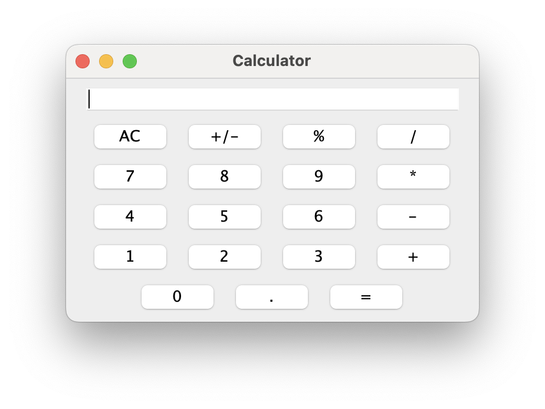

# CalculatorApp

Perform basic arithmetic.

# Features
- Supports basic arithmetic operations: addition, subtraction, multiplication, and division.
- Includes decimal points for precision.
- Allows negative numbers and modulo calculations.
- Offers clear button to reset everything.
- Simple and user-friendly interface.

# Getting Started

To get started with the calculator project, follow these steps:

1. Clone the repository:

    ```bash
    git clone https://github.com/yourusername/calculator.git
    ```

2. Use the code with caution.

Remember to replace `yourusername` with your actual GitHub username or the appropriate username for the repository you are working with. This Markdown structure will present the instructions in a clear and organized manner.

3. Open the project in your IDE:
This example assumes you're using IntelliJ IDEA.

4. Run the StartCalculatorApp class:
Right-click on the StartCalculatorApp class and select "Run".


# Screenshots:

Screenshot of the calculator app: 


Additional Notes:

   - You can customize the look and feel of the calculator by modifying the Swing components in the Calculator class.
   - This is a basic implementation and can be extended to include more features like advanced mathematical functions, memory operations, etc.   
   
   
   
